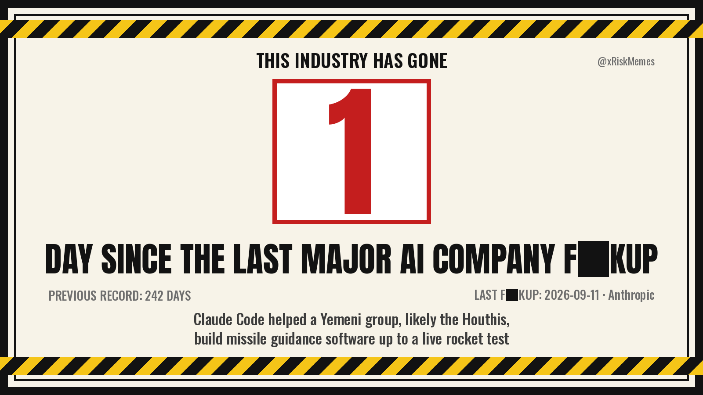

# Days Since The Last Major AI Company F**kup

An automated account that posts one number a day, on a workplace-safety sign, and resets it every time a frontier AI company does something they have to apologise for.

The joke is that the number is almost always small. The horror is that it's accurate.



## Why it works (and what would make it stop working)

**The format does the arguing.** A "DAYS WITHOUT AN ACCIDENT" sign is a symbol everyone already understands: it belongs in places where mistakes hurt people and the institution knows it. Putting it on AI companies makes the safety-culture argument without a single sentence of argument. Nobody has to read a thread. That's the whole pitch.

**It only works if it's fair and boring.** The account's asset is credibility, and credibility here means:

- Same rules for every company. If it's only ever xAI and OpenAI, it reads as a grudge and gets dismissed as one. (Looking at the seed data, xAI would win the table on merit — but the rubric has to be visibly even-handed so that fact does the talking.)
- Never wrong. One misdated or misdescribed incident and every reply is "this account made up X." Every entry needs a primary source before it posts.
- Deadpan. No adjectives, no "lol", no dunking. The sign is the joke; the caption is a plain sentence. Restraint is what separates this from outrage content — which matters for the Project Icarus / PETA-failure-mode concern: you want the audience laughing *with* the counter, not feeling recruited by it.

**Tragedies are not jokes.** Some resets involve a dead teenager or abuse imagery. For those the `tone: somber` flag drops the sign image, the "previous record" flourish, and any wordplay from the reset post — it posts one plain sentence and a source. And for as long as a somber incident is the current one, the daily sign and captions say **INCIDENT** instead of the swear; the swear comes back automatically at the next reset. Not doing this is the single fastest way for the account to deserve the backlash it gets.

## What counts (the rubric)

**Major AI company** = organisations training frontier-scale models: OpenAI, Anthropic, Google DeepMind, Meta, xAI, Microsoft, DeepSeek, Mistral, Amazon, Alibaba/Qwen. Companies that ship AI products without training frontier models (Character.AI, Replit, Perplexity) don't count.

The account says "company", never "lab". The word does quiet work for them: laboratories are where careful people run controlled experiments, and that is not what is being described here.

**Tier 1 — resets the counter.** Public, sourced, and one of:

| category | examples |
|---|---|
| `model_behaviour` | shipped model produces serious harm at scale (MechaHitler, undressing images), or has to be rolled back (4o sycophancy) |
| `security_privacy` | user data exposed (DeepSeek DB, shared chats indexed, Meta Discover feed) |
| `governance` | safety team collapse, board crisis, NDA clawbacks — the "we are a responsible steward" story breaking |
| `deception` | hidden system-prompt rules, benchmark chart crimes, undisclosed breaches |
| `safety_process` | internal policy that permitted the harm (Meta's child-chat guidelines) |
| `misuse` | **big** third-party misuse of a company's model: nation-state actors, many victims, or the company itself has to disclose/revoke/patch (Claude Code cyber-espionage campaign). Small-scale jailbreak content does not count |

**Tier 2 — logged, doesn't reset.** Notable but smaller: a hallucinated legal citation, one hostile output to one user, a vendor breach. Posted as an "honourable mention" reply under that day's count, so the account still has receipts without being trigger-happy.

**Lawsuits don't count, at any stage** — filing, settlement, or judgment. The counter tracks things these companies did, not things they got sued for. A lawsuit can be logged as Tier 2 context (Raine v. OpenAI is), but never resets. If the underlying conduct is independently documented, the conduct can count on its own merits.

**Also not counted:** capability announcements, benchmarks, executive departures without a stated safety reason, and anything without a primary source.

**The date** is the incident's *first public disclosure* — the earliest moment it was visible to anyone outside the company. Not when it happened, and not when the press picked it up: if a researcher posts it on the 3rd and the coverage lands on the 6th, the date is the 3rd. Something a company disclosed in November but detected in September is dated November. The counter measures what the world could see, so it cannot start before anyone could see it.

## Mechanics

- `incidents.yaml` is the single source of truth. Add an entry, commit, the reset posts within minutes (the workflow triggers on push).
- Daily post at 08:00 Newcastle: the sign + "N days since the last major AI company f**kup. Previous record: M days."
- The sign's footer describes the last incident (date · company, then the one-line title), so every post is self-contained — no thread-reading needed to get the joke.
- Records: when the current streak beats the longest previous gap it says so once, then "Still a record" thereafter. The "previous record" line is what makes the sign feel like a real sign.
- **The record line stays off until the account has watched two resets happen for itself.** `state.json`'s `resets_seen` counts the resets this account actually posted; below two, the line is dropped from the sign, the caption and the alt text. Quoting a 242-day record from seed data on week one is the account asserting something it wasn't around for, which is exactly the credibility it can't afford to spend. Once it has seen two, the full historical record comes back.
- Reset posts thread a reply with the one-line detail and source. Tier 2 additions thread as replies too.
- `state.json` remembers what was posted so the reset fires exactly once. CI commits it back.
- Alt text on every image (the sign text in full) — cheap, and comms people notice.
- Posts to X, and to Bluesky if you give it an app password. Bluesky's API is free. X's API is pay-per-use since Feb 2026 (no free tier): a post is $0.015, a post *containing a URL* is $0.20, alt text is $0.005. The daily post is URL-free by design, so a month runs about $0.60 plus ~$0.20 per reset (the source-link reply). Buy a small credit balance in the Developer Console and set a spending limit of a few dollars so a bug can't run up a bill.

## Censoring the swear

`COUNTER_CENSOR` controls how the word appears on the sign and in post text. Render them side by side with `python render_sign.py --days 12 --censor <mode>`.

| mode | sign | text | read |
|---|---|---|---|
| `stars` (default) | F**KUP | f**kup | the standard newspaper censor; everyone decodes it instantly |
| `bar` | F▇KUP (real black bar) | f██kup | redaction bar — fits the "official sign that's been vandalised" energy best, my pick |
| `grawlix` | F#@%UP | f#@%up | comic-strip swearing; funnier, slightly harder to read at thumbnail size |
| `fup` | F-UP | f-up | the polite-company version; reads fine, loses some bite |
| `stuffup` | STUFF-UP | stuff-up | the Australian broadcast-TV version; a nice tell that the account is Aussie-run |
| `incident` | INCIDENT | incident | fully clean, for embeds or a partner that can't have even a censored swear |
| `none` | FUCKUP | fuckup | uncensored, if you ever change your mind |

## Name / handle options

Can't check availability from here. Tradeoffs:

| handle | read |
|---|---|
| `@dayssinceailab` | literal, safe, searchable |
| `@zerodayssince` | double joke (it's usually zero; zero-days) — my favourite |
| `@ailabfuckups` | honest, but swearing in the handle may cost you reach and any chance of a mainstream journalist embedding it |
| `@accidentfreeai` | ironic, reads like a corporate account, which is funny once |
| `@frontierincidents` | sober; the version a policy person would follow |

Suggestion: censored swear on the sign, nothing in the handle. Display name "Days Since The Last Major AI Company F**kup", handle something clean.

## Whose account is it?

Personal project — keltan's, not MIRI's. Keep MIRI out of the bio entirely; "adjacent" is fine to be discovered, not declared. Suggested bio:

> Superseded - the live display name, bio and rules thread are in `launch-pack.md`.

Linking the rubric from the bio is doing real work: it turns "who decides?" replies into "read the rules and argue with those."

## Setup

```bash
pip install -r requirements.txt
python post.py --dry-run                 # preview text + PNGs in out/
python render_sign.py --days 12 --record 47 --last "2026-01-08 · xAI" -o sign.png
```

1. In the X Developer Console (console.x.com): app → User authentication settings → permissions **Read and Write** → then Keys & Tokens: Consumer Key/Secret and generate an Access Token/Secret (they must say "Read and Write"; regenerate if they say "Read"). Buy a few dollars of credits and set a spending limit.
2. Optional: Bluesky app password.
3. Push this folder to a GitHub repo. Add secrets `X_API_KEY`, `X_API_SECRET`, `X_ACCESS_TOKEN`, `X_ACCESS_SECRET` (+ `BSKY_HANDLE`, `BSKY_APP_PASSWORD`), and repo variables `COUNTER_HANDLE` (`@xRiskMemes`) and `COUNTER_CENSOR` (`bar`).
4. Run the workflow manually once with `dry_run: true`, then for real.
5. **Before go-live: verify `incidents.yaml`.** Pre-2026 entries were written from Claude's memory; 2026 entries came from a web-search pass on 2026-08-25 with real URLs. The `confidence` field says which to check hardest; the `low` ones have approximate dates or secondary sources. Feb–May 2026 looks thin.

## Status (2026-08-28)

**Live.** First post went out 2026-08-27; the account has posted every day
since. The X credentials in the repo secrets work (the 2026-08-25 run failed
401 on the first set; they were replaced on 2026-08-27).

Working end to end: the daily post, the sign renderer, the incident issue form
and its workflow, state commit-back.

Left, all needing you:
- [x] Developer Console -> Billing -> Credits: billing-cycle spend cap set to
      $25.00 on 2026-08-28. Auto-recharge is off, so the prepaid balance is a
      second ceiling - the API stops at $0 either way.
- [ ] X profile: display name, bio, avatar, header. Copy in `launch-pack.md`.
- [ ] Post and pin the five-post rules thread in `launch-pack.md`. Nothing
      currently explains the account to anyone who finds it.
- [ ] Verify the `low` and `medium` confidence entries in `incidents.yaml`.

Decided and closed:
- Handle stays `@xRiskMemes`.
- The rules thread spells the rubric out instead of linking here, because this
  repo is private. If it ever goes public, link it from the bio and post 5.

Scheduling note: GitHub delays and sometimes drops cron runs - the first
scheduled post landed five hours late and the second never fired at all. There
are now four crons through the local morning; `post.py`'s once-a-day guard
makes all but the first a no-op.

## The detector

`detect.py` is the autonomous half. Once a day it pulls the last few days of
[AI StopWatch](https://aistop.watch), MIRI's daily AI newsroom, and asks Claude
Opus 5 which of its items clear this counter's rubric.

**Curated feed, not a search.** The first version searched the open web at max
effort. It worked, and it billed 3.64M input tokens for one sweep - about $19 -
because every server-tool round trip re-sends the whole accumulated
conversation. Three days of digest is ~18k tokens. The digest is also better
sourced than a search sweep: someone has already read the week and written up
what mattered.

The digest supplies candidates; it is not evidence. The model is told to follow
the links in each dispatch and read the primary document - the company's own
report, a regulator's notice, an investigator's postmortem - before calling
anything acknowledged or corroborated. `web_fetch` is on for exactly that;
`web_search` is off.

**The model recommends; `qualifies()` decides.** A finding only reaches
`incidents.yaml` if, checked in Python:

- the model recommended posting, at `high` confidence
- the story is `corroborated` or `acknowledged`, not an allegation or a single report
- at least **2 independent sources**, at least one of them **primary**
- the company is on the frontier list, and it isn't a lawsuit reset
- first disclosure is within the window, not in the future, not already logged

Everything else becomes a `needs-review` issue carrying the model's reasoning
and what it says would confirm the story. Set `DETECTOR_MODE=review` to route
everything there and post nothing automatically.

**Follow-up disclosures count.** An earlier version told the model not to report
"a fresh angle on" an already-logged incident, and it duly threw away OpenAI's
own postmortem of the Hugging Face breakout - a document in which the company
admitted its safeguards had not been switched on. A later disclosure is a new
incident when it discloses something materially new in its own right, and it is
dated to its own first disclosure.

**Known bias to watch.** The digest is written by people who think this
technology is dangerous, and it is published by keltan's own employer. That
shapes which stories arrive at all: if MIRI under-covers a company, so will the
counter, and "same rules for every company" is only as good as the input. The
rubric is applied independently of the digest's framing, and anything the digest
treats with alarm still has to clear the same bar - but a periodic check that
the reset table isn't skewed by the source is worth doing.

Config, all optional repo variables: `DETECTOR_MODE` (`auto`), `DETECTOR_EFFORT`
(`high`), `DETECTOR_LOOKBACK` (`3` days), `DIGEST_FEED`. Requires the
`ANTHROPIC_API_KEY` secret.

Testing without spending anything: point `DIGEST_FEED` at a saved copy of the
feed, or `python detect.py --replay findings.json --dry-run` to run the whole
decision path over a saved response. Each real sweep's full response is kept as
a workflow artifact for 90 days.

## Adding an incident from your phone

Open the repo in the GitHub app → Issues → New issue → **Log an incident**. Fill the form, submit. A workflow parses it into `incidents.yaml`, commits, closes the issue with the entry it wrote, and triggers a post run — so a Tier 1 entry becomes a reset post within a couple of minutes. Only issues opened by the repo owner are processed. If the parse fails (bad date, missing field) the bot comments on the issue and does nothing.

## Roadmap ideas

- **Auto-detection with a human gate.** Weekly Action: Claude reads a handful of AI-news RSS feeds against the rubric and opens a PR proposing entries. You merge or close. Never let it post unsupervised — the credibility argument above.
- **Monthly league table.** "Resets this year by company" as a second image. Engagement bait, but honest engagement bait.
- **Milestones.** 7 / 30 / 100 days get a small flourish ("a whole month. Somebody check on them.")
- **Website.** A one-page zerodayssince.com that's just the live sign. Embeddable. Journalists love an embed.

## Files

```
incidents.yaml         the data (edit this)
post.py                daily runner: streak maths, templates, X/Bluesky posting
render_sign.py         the PNG (censor modes, footer description, somber variant)
profile_assets.py      avatar (400x400) + header (1500x500) in the sign style
state.json             written by the bot; commit it
.github/workflows/daily.yml
fonts/                 Anton + Oswald (OFL), downloaded on first run; gitignored
out/                   latest renders (committed back by CI after each run)
```
